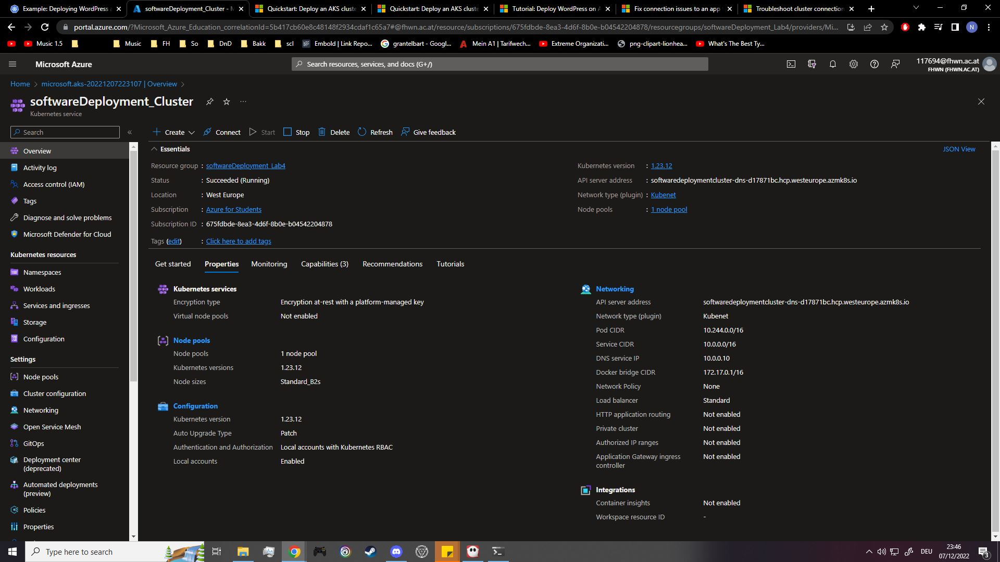
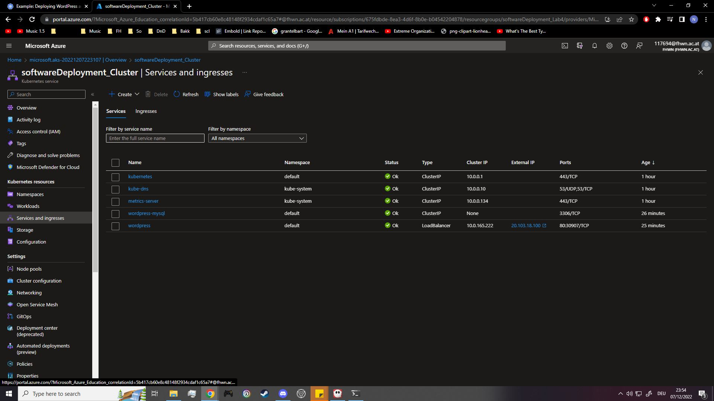
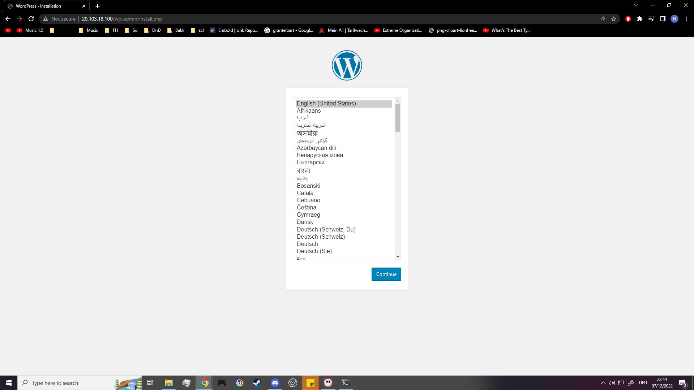
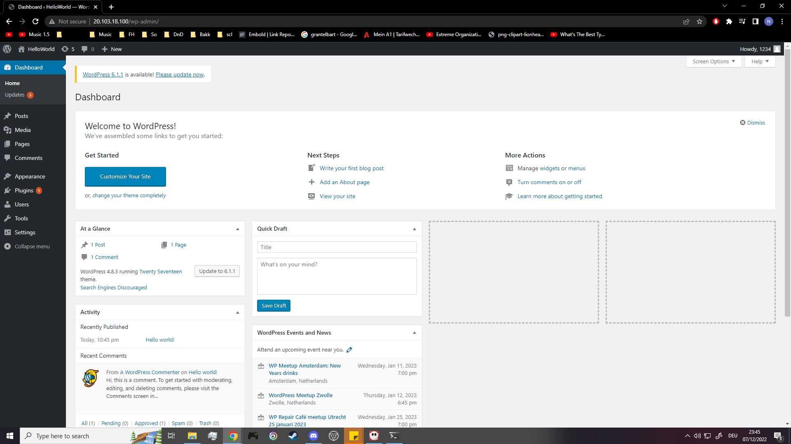

## Creation/Connection
The AKS has been created and connected to with the help of the following guides:


- https://learn.microsoft.com/en-us/azure/aks/learn/quick-kubernetes-deploy-cli
- https://learn.microsoft.com/en-us/azure/aks/learn/quick-kubernetes-deploy-portal?tabs=azure-cli

Following steps have been followed:

1. In Azure Portal: Created the AKS. It may be found under:
	1. Create a resource
	2. Categories - Containers
	3. Azure Kubernetes Service (AKS)
2. In CLI:
```
1. az login
2. az aks install-cli
3. az provider register
4. az provider register --namespace Microsoft.OperationsManagement
5. az provider register --namespace Microsoft.OperationalInsights
6. kubectl get nodes
```

### Problems:
- While on step (2.), I got an error complaining about the system path variable. After following the instructions of the error text it worked.

## Deployment
The two .yaml-files have been created by following the following guide:

https://kubernetes.io/docs/tutorials/stateful-application/mysql-wordpress-persistent-volume/

The steps for deployment are as follows:

1. Create the two .yaml-files.
2. Define a password by using the following command:
```
kubectl create secret generic mysql-pass --from-literal=password=<passwordhere>
```
3. Create pods
```
kubectl apply -f mysql-deployment.yaml
kubectl apply -f wordpress-deployment.yaml
```
4. Check if everything is running correctly by running
```
kubectl get services
```

### Problems
I forgot to create the secret the first time around - due to this the cluster was deployed, but upon trying to connect to the site I got the error "site can't be reached."

I checked the pods by running
```
kubectl get pods
```
and got the following result:
```
NAME                              READY   STATUS                       RESTARTS   AGE
wordpress-687f77b58d-d786x        0/1     CreateContainerConfigError   0          8m52s
wordpress-mysql-db6648954-fxbpx   0/1     CreateContainerConfigError   0          9m6s
```
I then added the secret by following step (2.) and the problem got resolved.

I managed to resolve this error relatively quickly thanks to following sites:

- https://komodor.com/learn/how-to-fix-createcontainerconfigerror-and-createcontainer-errors/
- https://stackoverflow.com/questions/65671862/mysql-kubernetes

## Start/Stop/Delete the Cluster
Easiest to do within the Azure Portal. Commands may also be used:

```
az aks start --name <clusterName> --resource-group <resourceGroupName>
az aks stop --name <clusterName> --resource-group <resourceGroupName>
az group delete --name <resourceGroupName> --yes --no-wait
```

## Access the Website
You may access the website with the external IP you find on the Azure Portal "Services and ingresses" tab.

Alternatively, you may input following command:
```
kubectl get services
```
```
Sample Output:
NAME              TYPE           CLUSTER-IP     EXTERNAL-IP     PORT(S)        AGE
kubernetes        ClusterIP      10.0.0.1       <none>          443/TCP        66m
wordpress         LoadBalancer   10.0.165.222   20.103.18.100   80:30907/TCP   21m
wordpress-mysql   ClusterIP      None           <none>          3306/TCP       21m
```

## Screenshots



